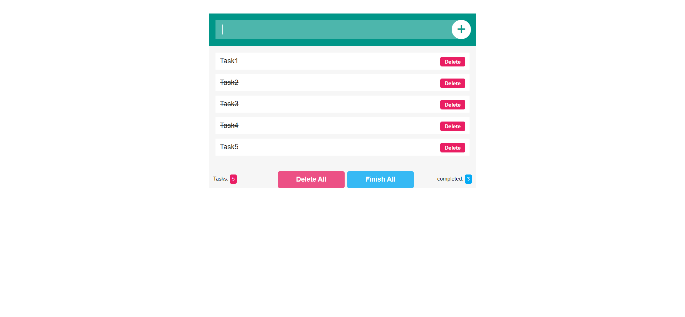

# Todo List

---

---

## Advantages

- You can add an infinite number of tasks
- The app calculate all tasks as well as the completed tasks
- When you open the app again, you can return to the same tasks that were entered by local storage

---

## Installation

    > git clone git@github.com:Bartekus/todo-js-basic.git
    > cd todo-js-basic
    > open index.html

---

## Directory Layout

├── /css/ ----> # CSS folder
│ └── /style.css ----> # Basic CSS stylesheet
├── /js/ ----> # JavaScript folder
│ └── /main.js ----> # Main app source
├── .gitignore ----> # Version control omission file
│── index.html ----> # Main entry point
└── README.md ----> # This file

---
